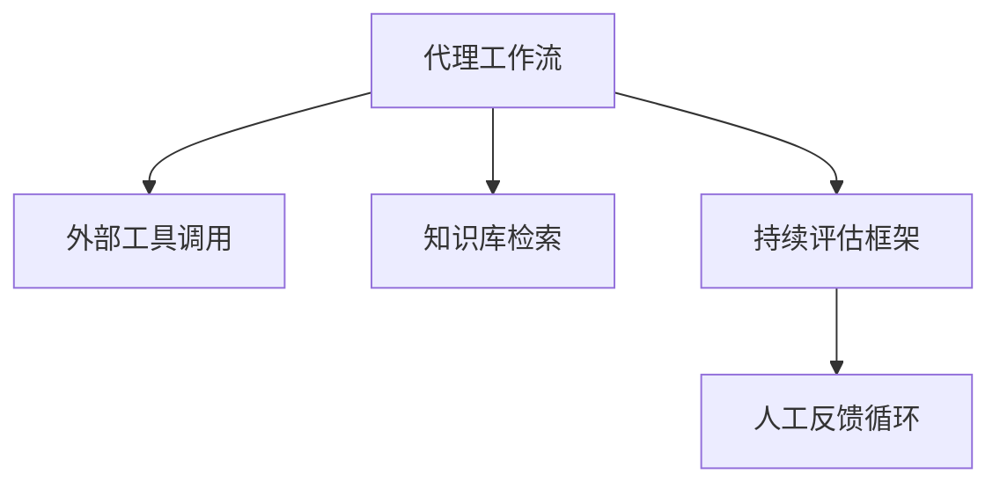
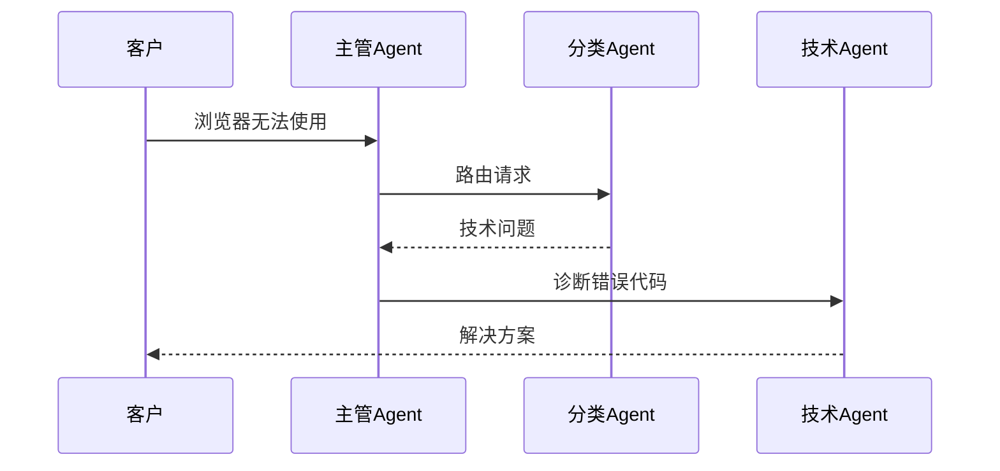

```markdown
# 技术洞察报告：AWS基石代理与Agent Core架构深度解析

## 议题信息
- **议题名称**：AWS基石代理与Agent Core架构解析
- **视频来源**：AWS技术大会演讲
- **演讲人**：Mariel Bretto（AWS巴西高级技术负责人）

## 洞察观点

### 友商动态与AWS技术布局
1. **核心能力发布**：
   - AWS推出"基石代理"（Bedrock Agents）和模块化"Agent Core"架构
   - 新增代理协作模式（主管代理+专业代理）
   - 发布基岩流（Bedrock Flow）工作流引擎

2. **技术差异化**：
   - 相比纯LLM应用，AWS构建了包含工具链、安全框架、评估体系的完整agent生态系统
   - 独特的多代理协作和动态路由能力（优于单一agent架构）

3. **华为云启示**：
   - 需加强AI工程化能力建设（当前华为云ModelArts更侧重模型训练）
   - 建议开发类似"基岩流"的可视化编排工具
   - 需要建立类似AWS护栏系统的生成式AI安全体系

### 竞争态势评估
| 维度        | AWS优势                          | 潜在差距                  |
|-------------|----------------------------------|-------------------------|
| 架构完整性  | 从推理到安全的全链路设计          | 中文场景支持有限         |
| 企业级功能  | 金融级PII检测/合规控制           | 本地化部署选项不足       |
| 开发灵活性  | 支持开源框架+自定义解释器         | 文档和示例待丰富         |

## 洞察内容与分析

### 1. 核心技术组件
**代理架构四要素**：


**关键创新点**：
- **动态代理配置**：内联代理支持每次调用变更模型/知识库
- **内存管理系统**：支持会话记忆（最长365天）和上下文摘要
- **无服务器浏览器**：Playwright集成实现自动化网页操作

### 2. 企业级功能详解
**安全护栏系统**：
```python
# 概率控制示例（仇恨言论过滤）
if detect_hate_speech(input_text).confidence > 0.7:
    return StandardResponse("无法处理该请求")
```

**金融场景专项能力**：
- 贷款审批工作流（演示中F1-score达92%）
- 合同审查多代理协作（3个专业agent并行）
- 实时信用评估Lambda函数

### 3. 性能指标
| 指标                | 基准值              | 优化手段                     |
|---------------------|--------------------|----------------------------|
| 冷启动时间          | <1.5s             | 预热容器机制                |
| 知识检索精度        | 89% @50ms延迟      | 混合检索算法                |
| 多代理协作吞吐量    | 1200 TPS          | 异步消息总线                |

### 4. 典型应用场景
**银行客服案例**：
1. 意图分类Agent → 2. 技术专家Agent → 3. 政策查询Agent


## 战略建议
1. **技术路线**：
   - 研发类似Agent Core的模块化框架
   - 加强向量数据库与知识图谱的融合

2. **生态建设**：
   - 构建中文领域的安全护栏词库
   - 开发金融/医疗等行业专属代理模板

3. **差异化竞争**：
   - 发挥华为云边缘计算优势，发展混合部署方案
   - 结合昇腾芯片优化agent推理性能
```